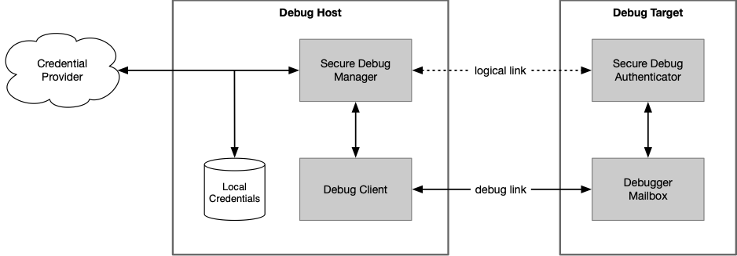

# Secure Debug Manager API

This repository contains the API definition for the Secure Debug Manager.

A very abstract system architecture for secure debug is shown below. The Secure Debug Manager (SDM)
is the host-side component that implements a secure debug protocol.

The Debug Client is the process that wishes to debug a locked target. Usually this would be an IDE
or standalone debugger used by a developer or technician, but can be any sort of tool that needs
debug access to the target. The SDM is used by the Debug Client to securely unlock debug access.

The requirements for the Secure Debug Manager API are as follows:

- Support any secure debug protocol that uses the debug link for communications.
- Usable for any debug client.
- Independent of the debug link.
- Debug architecture independent.
- OS independent (though the shared library for an implementation will naturally be OS dependent).

The SDM API is being defined so tools can support a variety of secure debug implementations with a
single API. Tools vendors are encouraged to standardize on this API in order to ease the support
burden on silicon and software providers, as well as themselves, and provide simple and easy to use
integration of secure debug for users.

The goal is for silicon or software vendors to be able to provide an implementation of the API as a
shared library that would be included with tools as part of device support. The SDM library will
likely also be included in CMSIS Device Family Packs.

The SDM API is designed to be debug architecture agnostic, so it can be used on debug architectures
other than Arm ADI. However, a given implementation of the API will naturally support only those
debug architectures for which it was written.

The SDM API will support any secure debug protocol. A reference implementation will be provided for
the PSA Authenticated Debug Access Control (PSA ADAC) protocol. As part of this reference
implementation, additional lower-level APIs are planned be defined for layers such as a credential
provider and debug mailbox interface.

### Structure

The main [`secure_debug_manager.h`](include/secure_debug_manager.h) header file is located in the
[`include/`](include) directory.

A doxygen configuration file is available to generate documentation for the API.

An XML manifest file will be included with the SDM shared library. The included
[`xml/manifest.xml`](xml/manifest.xml) file is an example manifest for experimentation.

The manifest serves several purposes:

- It allows one SDM implementation to be configured for different targets.
- It gives the debug client information about the library.
- It describes user interface options.

Eventually a proper schema will be created for the manifest.

### Status

The overall structure for the API is well defined; some details are very much in progress. All
feedback is appreciated.

Remaining tasks are collected in the [`todo.md`](todo.md) file.

PSA ADAC related lower-level APIs are not yet defined.

### License

The files are covered by the BSD 3-Clause license. However, this repository is currently considered
confidential and is only accessible under NDA.

Copyright © 2020 Arm Ltd.
